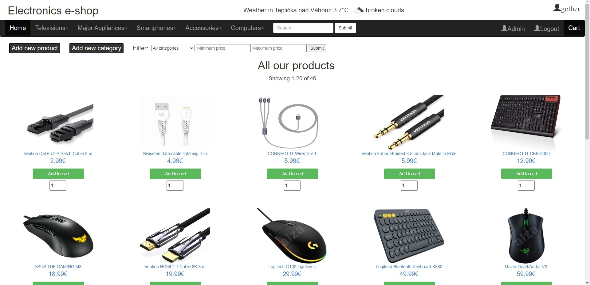
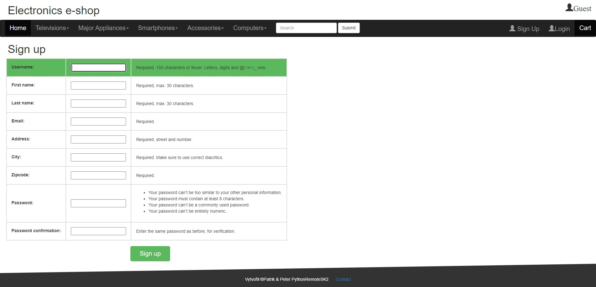
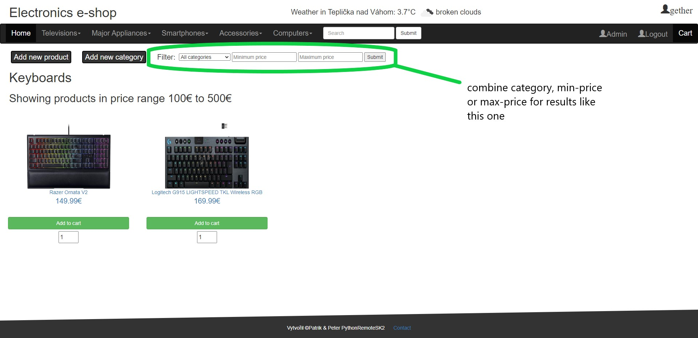
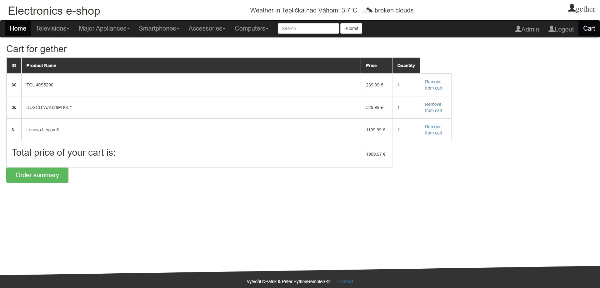
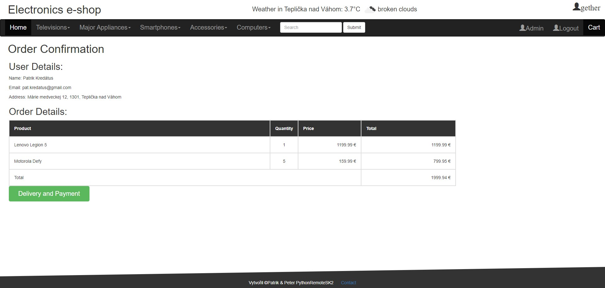
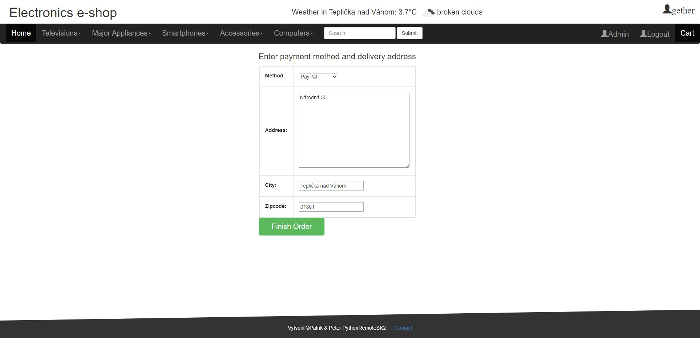
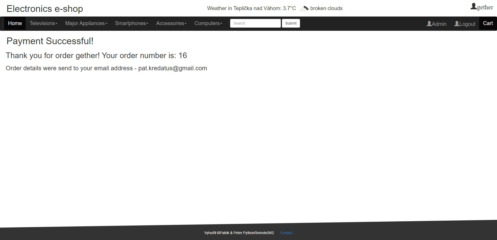

# Welcome to our e-shop (screenshots at bottom)

## Functionalities: ##

- ### Navbar:
     - home button to redirect back on homepage,
     - category tree,
     - search,
     - user login/logout,
     - cart,
     - admin button to access Django database(admin only)
- ### Homepage with all products in database ordered from the lowest price
   - paginator to list in products
- ###  User sign-up, login, and logout:
  - sign-up is extended with first_name, second_name and address (street, city and zipcode)
  - sign-up and login are visible only for guests(not logged-in users)
  - logout visible only for logged-in users
- ###  Search:
  - if you submit correct input, it filters products ordered by title,
  - otherwise you get error message and can try it again
- ###  Add category, product and edit product (admin only)
- ###  Weather widget with API, according to user's city (logged-in users only)
- ###  Filtering products by secondary category, price or combination of both (7 options)
- ###  Cart:
  - if cart doesn't exist yet, database creates empty one by default as "paid=False"
  - add or remove products,
  - proceed to order confirmation to show details (user + products)
  - proceed to payment where you choose payment method and delivery address
  - after successful payment, instead of creating Order, Cart is changed as "paid=True"
- ###  Each product has all details shown after clicking on them
- ### Contact link at the bottom of site, showing details of creators

## Screenshots

### Homepage

### Sign-up

### Filtering (combine as desired, 7 options)

### Cart with whole proccess

